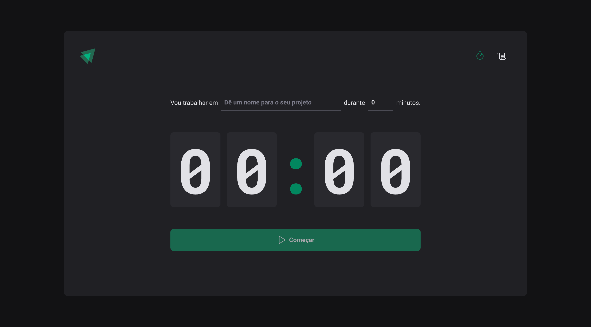
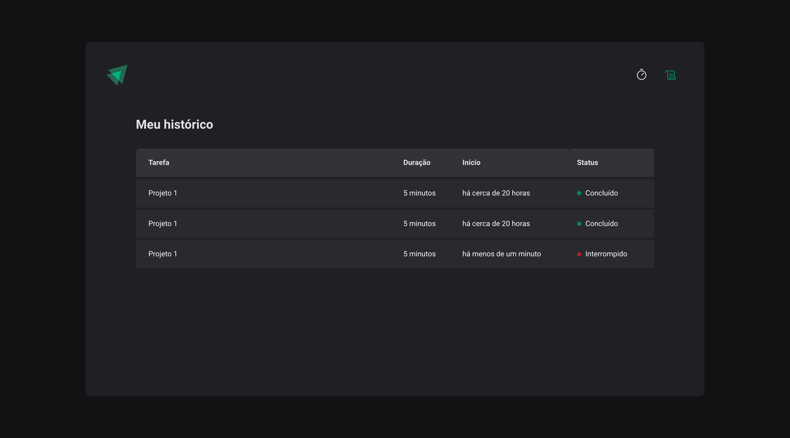
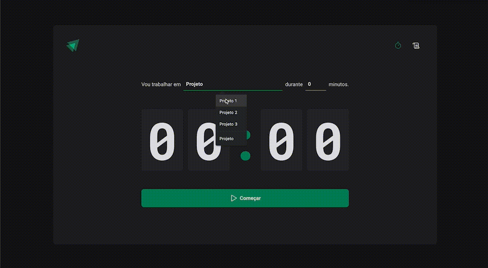

<p align="center">
  
</p>

<br />

<p align="center">
  
  
  
</p>

[](https://github.com/lzhudson)
[](#)
[](https://github.com/lzhudson/ignite-timer/stargazers)
[](https://github.com/lzhudson/ignite-timer/network/members)
[](https://github.com/lzhudson/ignite-timer/graphs/contributors)

# :pushpin: Table of Contents

* [Features](#rocket-features)
* [Installation](#construction_worker-installation)
* [Found a bug? Missing a specific feature?](#bug-issues)
* [Contributing](#tada-contributing)
* [License](#closed_book-license)

# :rocket: Features

* Init timer
* Interrupt timer
* Check history of started timers
* Save in local storage

# :construction_worker: Installation

**You need to install [Node.js](https://nodejs.org/en/download/) and [Yarn](https://yarnpkg.com/) first, then in order to clone the project via HTTPS, run this command:**

```
git clone https://github.com/lzhudson/ignite-timer.git
```

SSH URLs provide access to a Git repository via SSH, a secure protocol. If you have a SSH key registered in your Github account, clone the project using this command:

```
git clone git@github.com:lzhudson/ignite-timer.git
```


**Install dependencies**

```
yarn install
```

**Start development server**

```
yarn dev
```

# :bug: Issues

Feel free to **file a new issue** with a respective title and description on the [Ignite TImer](https://github.com/lzhudson/ignite-timer/issues) repository. If you already found a solution to your problem, **I would love to review your pull request**! Have a look at our [contribution guidelines](https://github.com/lzhudson/ignite-timer/blob/main/CONTRIBUTING.md) to find out about the coding standards.

# :tada: Contributing

Check out the [contributing](https://github.com/lzhudson/ignite-timer/blob/main/CONTRIBUTING.md) page to see the best places to file issues, start discussions and begin contributing.

# :closed_book: License

Released in 2023
This project is under the [MIT license](https://github.com/lzhudson/ignite-timer/main/LICENSE).

Designed by [Rockeseat](https://github.com/Rocketseat) and developed by [Hudson Holanda](https://github.com/lzhudson) 🖤🚀